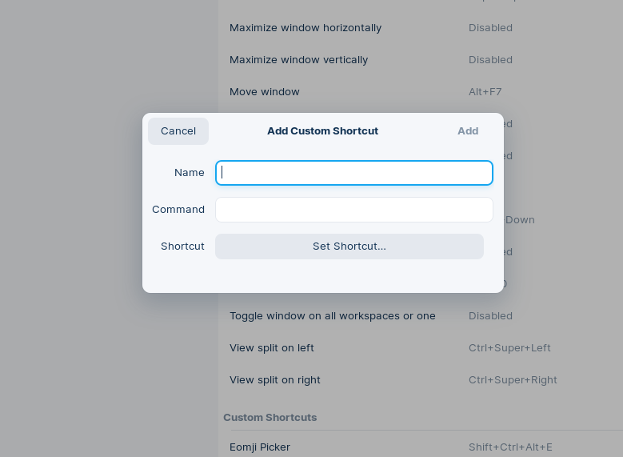

<p style="text-align:center;">

</p>

# Emoji Picker

A super simple and small tool to get your emoji when you need it.


## Development

    You first need to install [NeutralinoJS](https://neutralino.js.org/docs/getting-started/your-first-neutralinojs-app), then run the following command while you're pointing at the source code folder:

```bash
neu run
```

## Bonus Tip

If you're running Linux (like me), there's a very nice way to get the full benefit from the tool

- First, create a bash script file, call it anything, like `emojipicker.sh`.

- Paste this line inside the bash script, make sure to change the path to where the executable Linux version of the tool is located.
  
  - ```bash
    cd /[The path of the tool] && ./mhmdkrmabd-emoji-picker-linux_x64
    ```

- Navigate to `Settings`, `Keyboard Shortcuts`, then choose to `Add Custom Shortcut` :
  
  -  

- Choose any name you like, the command would be `sh /[The path to the script].sh`, and finally set the shortcut you like.

In this way, you'll be able to call the tool whenever you want usin your keyboard.

## License

    The tool is under **MIT licenses**, so feel free to fork, or download the repo and play around with the source code.

    And thats it, have a look at NeutralinoJS to get a better developing experience, happy coding 🥳.
